# Entity Relationship Diagram

GitHub renders the Mermaid diagram below. The DDL that it describes lives in `database/02_reference_tables.sql`, `03_core_tables.sql` and `04_finance_tables.sql`.

```mermaid
erDiagram
    FiscalYear ||--o{ Ship : "defines accounting period of"
    ShipStatus ||--o{ Ship : "classifies"
    Ship ||--o{ CrewServiceHistory : "has contracts"
    CrewMember ||--o{ CrewServiceHistory : "serves under"
    CrewRank ||--o{ CrewServiceHistory : "held during"
    Department ||--o{ CrewRank : "groups"
    Country ||--o{ CrewMember : "nationality of"
    AppRole ||--o{ AppUser : "grants"
    AppUser ||--o{ UserShip : "is assigned"
    Ship ||--o{ UserShip : "is assigned to"
    AppUser ||--o{ ApiKey : "authenticates with"
    AppUser |o--o{ AuditLog : "performed"
    Account |o--o{ Account : "parent of"
    Ship ||--o{ BudgetEntry : "budgeted for"
    Account ||--o{ BudgetEntry : "child account of"
    Ship ||--o{ AccountTransaction : "incurred by"
    Account ||--o{ AccountTransaction : "child account of"

    FiscalYear {
        CHAR(4) FiscalYearCode PK "MMNN, e.g. 0403"
        TINYINT StartMonth "1-12"
        TINYINT EndMonth "month before StartMonth"
        NVARCHAR(50) Description
    }
    ShipStatus {
        TINYINT ShipStatusId PK
        VARCHAR(20) StatusName UK "Active, Inactive"
        BIT IsOperational "only operational ships in crew lists and reports"
    }
    Ship {
        INT ShipId PK
        VARCHAR(10) ShipCode UK "^[A-Z0-9]{3,10}$"
        NVARCHAR(100) ShipName
        CHAR(4) FiscalYearCode FK
        TINYINT ShipStatusId FK
        DATETIME2 CreatedAtUtc
        DATETIME2 UpdatedAtUtc
        ROWVERSION RowVer
    }
    Department {
        TINYINT DepartmentId PK
        VARCHAR(20) DepartmentName UK "Deck, Engine, Catering"
    }
    CrewRank {
        SMALLINT RankId PK
        VARCHAR(10) RankCode UK
        NVARCHAR(50) RankName UK
        TINYINT DepartmentId FK
        SMALLINT SeniorityOrder UK "1 = Master"
    }
    Country {
        CHAR(2) CountryCode PK "ISO 3166-1"
        NVARCHAR(100) CountryName
        NVARCHAR(50) NationalityName
    }
    CrewMember {
        VARCHAR(20) CrewMemberId PK "^[A-Z0-9]{3,20}$"
        NVARCHAR(100) FirstName
        NVARCHAR(100) LastName
        DATE BirthDate
        CHAR(2) NationalityCode FK
    }
    CrewServiceHistory {
        INT CrewServiceId PK
        VARCHAR(20) CrewMemberId FK
        INT ShipId FK
        SMALLINT RankId FK
        DATE SignOnDate
        DATE SignOffDate "NULL = not signed off"
        DATE EndOfContractDate
    }
    AppRole {
        TINYINT RoleId PK
        VARCHAR(30) RoleName UK
        NVARCHAR(200) Description
        BIT IsAdministrator
    }
    AppUser {
        INT UserId PK
        NVARCHAR(100) FullName
        NVARCHAR(254) Email UK "optional, unique when set"
        TINYINT RoleId FK
        BIT IsActive
    }
    UserShip {
        INT UserId PK, FK
        INT ShipId PK, FK
        DATETIME2 AssignedAtUtc
        INT AssignedByUserId FK
    }
    ApiKey {
        INT ApiKeyId PK
        INT UserId FK
        CHAR(8) KeyPrefix "non-secret identifier"
        BINARY(32) KeyHash UK "SHA-256, never the raw key"
        DATETIME2 ExpiresAtUtc
        DATETIME2 RevokedAtUtc
        DATETIME2 LastUsedAtUtc
    }
    AuditLog {
        BIGINT AuditLogId PK
        DATETIME2 OccurredAtUtc
        INT ActorUserId FK
        VARCHAR(50) Action
        VARCHAR(30) EntityType
        NVARCHAR(50) EntityKey
        NVARCHAR(400) Details "no PII"
    }
    Account {
        INT AccountId PK
        VARCHAR(20) AccountNumber UK
        NVARCHAR(200) Description
        CHAR(1) AccountType "P = parent (summary), C = child (detail)"
        INT ParentAccountId FK "parent must be type P"
    }
    BudgetEntry {
        BIGINT BudgetEntryId PK
        INT ShipId FK
        INT AccountId FK "child accounts only"
        DATE AccountPeriod "first day of month"
        DECIMAL BudgetAmount ">= 0"
    }
    AccountTransaction {
        BIGINT AccountTransactionId PK
        INT ShipId FK
        INT AccountId FK "child accounts only"
        DATE AccountPeriod "first day of month"
        DECIMAL ActualAmount ">= 0"
        DATE TransactionDate
        NVARCHAR(50) Reference
    }
```

## Design notes

| Topic | Decision |
|---|---|
| Normalization | 3NF. Lookups (fiscal year, ship status, department, rank, country, role) are tables, not hard-coded values. |
| Keys | Joins use surrogate `INT IDENTITY` keys. Business keys (`ShipCode`, `CrewMemberId`, `AccountNumber`) are `UNIQUE` and are the only identifiers the API exposes. |
| Rank per contract | Rank is stored on `CrewServiceHistory`, not on `CrewMember`, because seafarers are promoted between contracts. |
| Crew status | Never stored. It is derived from the dates as of a given day (`tvf_CrewStatus`), so it can't go stale. |
| One rank per ship | Not enforced, because handovers overlap by a day or two (D-03). |
| Child-only postings | `BudgetEntry` and `AccountTransaction` carry `AccountType = 'C'` with a composite FK to `Account(AccountId, AccountType)`, so posting to a parent is impossible. |
| Parent must be a summary account | A persisted computed column `ParentAccountType = 'P'` plus a composite self-FK. |
| Amounts | `DECIMAL(19,2) NOT NULL CHECK (>= 0)`. "No data" is the absence of rows, which reports show as `NULL`; a stored `0` is a known zero (D-06). |
| Multiple rows per key | Allowed for budgets and actuals, and summed in reports (D-05). |
| Audit | `AuditLog` is append-only: a trigger blocks `UPDATE` and `DELETE`. |
| Optimistic concurrency | Mutable tables carry a `ROWVERSION` column. For ships it is exposed as the API's `ETag` and checked against `If-Match` inside `usp_Ship_Update`, so concurrent edits get 412 instead of a lost update (D-30). |
